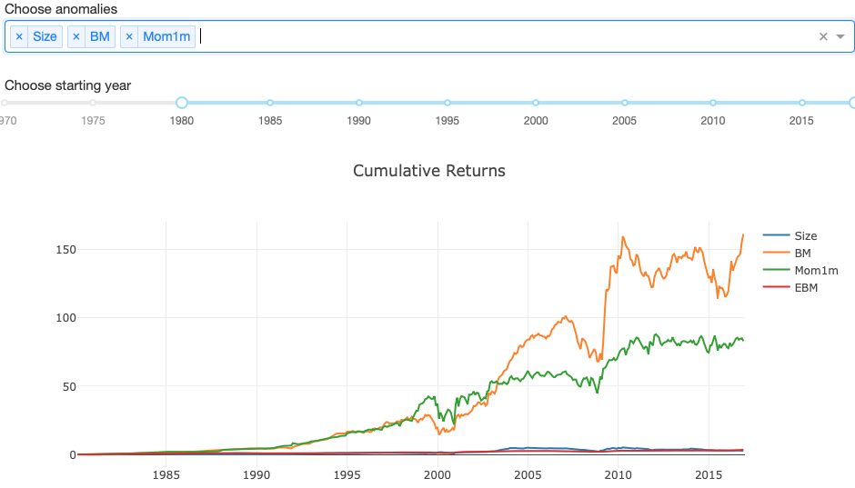

# Anomalies
A visualization of 143 published stock market anomalies based on data from 
[Chen and Zimmermann (2019)](https://papers.ssrn.com/sol3/papers.cfm?abstract_id=2802357).

### Getting Started

1) Clone the repository
2) Download the 
[returns data](https://drive.google.com/open?id=0ByAFEgH1yFDCU3dZNWRXb0xZdFU) 
from Andrew Chen's Website. Place it here: `data/signal_month_returns.csv` so the app can find it. 
3) Install the required packages from 'requirements.txt', ideally in a virtual environment.
4) Run 'python application.py' in a terminal for local execution

### Demo

You can find a live demo (here)[https://anomalies.maximilianeber.com].  

